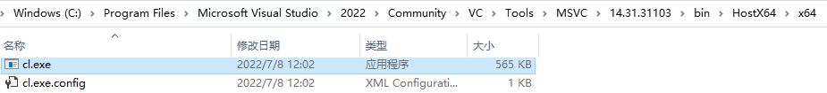
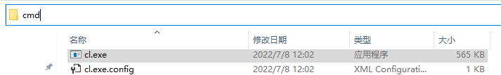
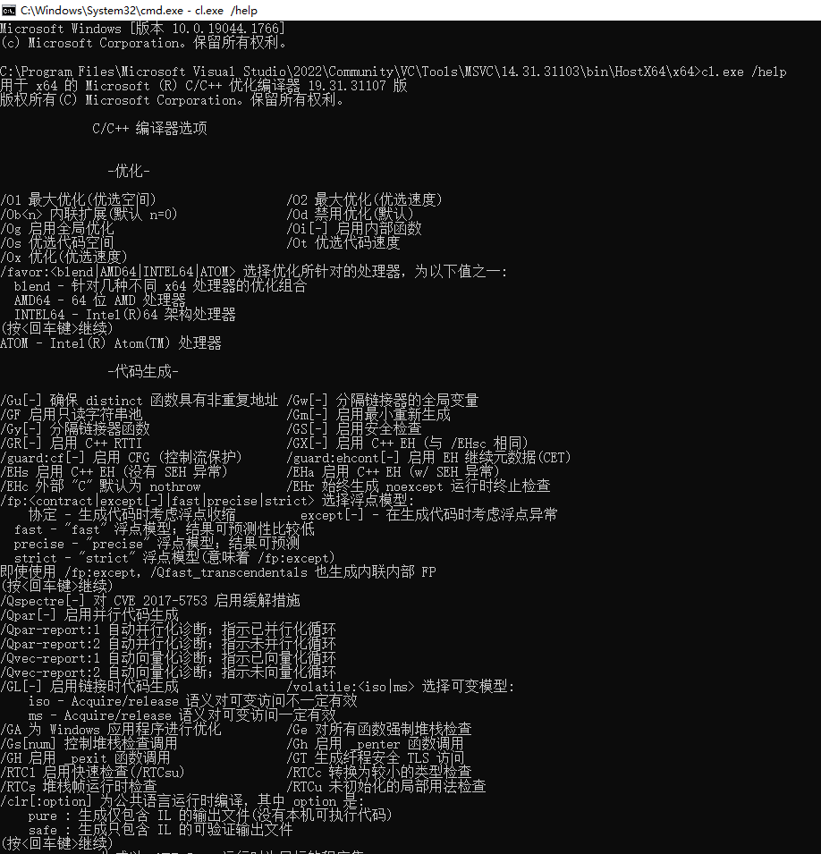
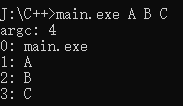
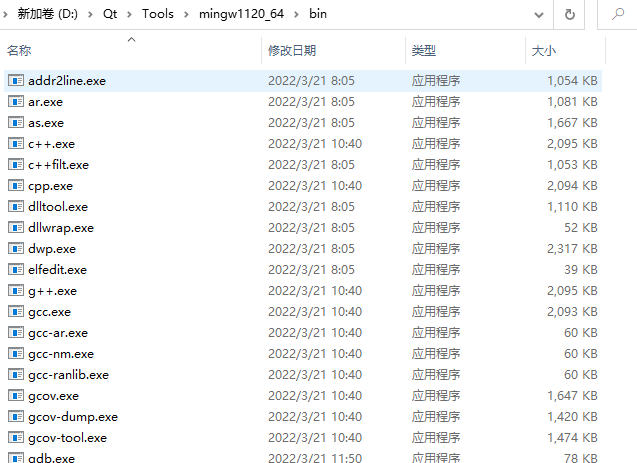

# C++

## 编译

将**IDE（Integrated Development Environment 集成开发环境）**当成编译器是很多初学小伙伴的弊病，一谈到编译器，可能第一反应会是 Visual Studio、Visual Studio Code、Clion、XCode、Dev、VC...

关于编译器，百度百科中有如下定义：

> ### [c++编译器](https://baike.baidu.com/item/c%2B%2B%E7%BC%96%E8%AF%91%E5%99%A8/2311223)
>
> [编译器](https://baike.baidu.com/item/编译器/8853067)就是将“[高级语言](https://baike.baidu.com/item/高级语言/299113)”翻译为“[机器语言](https://baike.baidu.com/item/机器语言/2019225)（低级语言）”的程序。
>
> 一个现代编译器的主要工作流程：[源代码](https://baike.baidu.com/item/源代码/3814213) (source code) → [预处理器](https://baike.baidu.com/item/预处理器/9067800) (preprocessor) → 编译器 (compiler) → [汇编程序](https://baike.baidu.com/item/汇编程序/298210) (assembler) → [目标代码](https://baike.baidu.com/item/目标代码/9407934) (object code) → [链接器](https://baike.baidu.com/item/链接器/10853221) (Linker) → [可执行程序](https://baike.baidu.com/item/可执行程序/5723075) (executables)。

> **维基百科**：https://en.wikipedia.org/wiki/C%2B%2B

常见的C++编译器有：GCC/G++、ICC、Clang、MSVC、BCC。

> 对于程序开发者而言，往往无需深入了解这些编译器细节，只需要知道它们存在、以及存在的意义即可。
>
> 关于它们的讨论，可查阅知乎[各个C/C++编译器有什么特长和不足？](https://www.zhihu.com/question/23789676)

如果你还没用过C++的编译器？那就跟UP一起来用一遍吧~

如果你有**Visual Stuidio**，可以在如下目录找到**cl.exe**



在**地址栏**输入`cmd`，按下`回车键`，可以在当前目录创建一个控制台窗口：



在控制台中输入`cl.exe /help`，按下`回车键`，你能看到它的帮助文档：

> 输入过程中按`Tab键`可自动补全



看着这些参数，是否有点眼熟？哟，这不是VS的项目配置吗？


cl.exe是一个命令行程序，下面我们将用这个命令行程序去生成我们自己的命令行程序。

首先，在任意路径下，新建一个新文件，名为**main.cpp**，其代码如下：

``` c++
#include <iostream>

/**
* argc 为参数的个数
* argv 为参数字符串数组
*/

int main(int argc,char** argv) {
	std::cout << "argc: " << argc << std::endl;
	for (int i = 0; i < argc; i++) {
		std::cout << i <<": " << argv[i] << std::endl;
	}
	return 0;
}
```

在windows文件浏览器的地址栏中输入`cmd`+`回车`，打开控制台创建，先输入指令`cl.exe+回车`，如果你看到下面的界面：


恭喜，你已经成功的第一步！

> 如果出现错误：**cl.exe 不是内部或外部命令，也不是可执行的程序**
>
> 是因为控制台程序在当前的工作目录下没有找到该文件，为了解决这个问题，操作系统往往会提供**环境变量**的设置，它允许一些特定目录下的文件可以被全局访问，关于环境变量，请查阅 [此处](https://baike.baidu.com/item/%E7%8E%AF%E5%A2%83%E5%8F%98%E9%87%8F/1730949?fr=aladdin)

接下来我们还需要初始化控制台的运行环境，一遍cl.exe能正确地搜索到C++的标准库路径，在VS的如下目录可以找到文件**vcvars64.bat**：


将之拖拽到我们刚刚的控制台窗口中，按下`回车`，就能成功初始化环境：


接下来再输入指令`cl.exe main.cpp`，编译该文件：


编译成功将生成两个文件：

- **main.obj**：目标文件，编译时的中间文件

- **main.exe**：windows下的可执行文件


> 这里实际上cl.exe进行了多个步骤：
>
> - 预编译：将源文件（`*.c`，`*.cpp`）输出为`*.i`文件：编译源代码中的预处理指令，比如#define，#include，#if...
> - 编译：将`*.i`编译为`*.s`文件：将高级语言转换为汇编语言。
> - 汇编：将`*.s`编译为`*.o`文件：将汇编语言转换成机器指令。
> - 链接：链接`*.o`文件，最终合并为可执行文件（windows下为`*.exe`）

再在控制台中输入指令`main.exe A B C`，将看到如下打印：



其中参数0为程序的启动路径，后面的A、B、C则是我们的附加参数。

在之后的开发过程中，你可能会碰到大量类似这样的命令行程序：

- 它们没有图形界面，只通过解析参数来完成各类工作，对于一些复杂的参数，有很多开源的**CommandLine解析库**，比如Qt的QCommandLineParser，Github上也有许多可供使用。
- 对于图形界面程序，也可以利用该参数实现一些其他功能，比如，通过在注册表中追加启动参数来让程序在执行时判断是否是开机自启。

> 在Visual Studio中，也可手动设置该参数，用于开发时的调试：
>
> 

如果你有Qt的话，同样能在如下目录找到**MinGW**的编译套件：（关于它的使用，跟上面的步骤大同小异）



## 构建

上面我们用Visual Studio的CL编译器简单过了一遍C++的编译流程。

这里引入一个新的问题：在实际的工程开发当中，不可能只有一个源文件，这也意味着我们需要编写大量的构建指令。

可以通过**make工具**调用编写好的**makefile文件**来组织项目的构建，但由于makefile的指令无法跨平台，因此也涌现出了大量的跨平台工程构建工具，比如：

- [cmake](https://cmake.org/)：当下主流的跨平台构建工具
- [qmake](https://doc.qt.io/qt-6/qmake-manual.html)：由Qt提供的一个构建工具，目前Qt已全面转向Cmake，qmake已不再维护。
- [nmake](https://docs.microsoft.com/en-us/cpp/build/reference/nmake-reference)：Visual Studio的内置工具，负责执行Makefile中描述的编译链接步骤
- [xmake](https://xmake.io/)：国人编写的基于 Lua 的轻量级跨平台构建工具。

对于大部分C++初学者来说，项目的构建可能大多时候都是直接使用IDE的图形化界面，比如Visual Studio：


这样做确实可以满足我们初期的一些小的开发需求，比如编程训练，小项目之类，但在开发一些庞大的工程项目时，使用图形界面的方式管理会异常困难，这点在后面的章节细谈。

## IDE

**IDE（Integrated Development Environment 集成开发环境）**是现代程序员接触最频繁的工具，当下主流的C++ IDE有：

- [Visual Studio](https://visualstudio.microsoft.com/zh-hans/)：由微软提供，被很多人尊称为“宇宙第一IDE”，体积庞大，Windows系统下的开发首选。

  

- [Qt Creator](https://www.qt.io/product/development-tools)：由Qt官方提供的IDE，跨平台，功能上中规中矩，对于Qt程序的开发来说比较友好。

  

- [Clion](https://www.jetbrains.com/zh-cn/clion/)：**JET BRAINS**提供的IDE，代码的辅助功能很巴适，旗下另一IDE — **Rider**：专门为游戏引擎开发而立。

  

- [XCode](https://developer.apple.com/xcode/)：Mac系统下的IDE

  

  

- [Visual Studio Code](https://code.visualstudio.com/)：微软提供的跨平台代码编辑器，通过扩展插件可以使得它一样能进行程序编译。

  

IDE对开发者而言，大多是使用习惯上区别，针对C++开发，笔者更建议在Windows上使用 Visual Studio编写C++工程，Visual Studio Code编写脚本或其他文本文件。

## 学习途径

对于C++初学者而言，最好的学习方式无疑是混迹于各大刷题平台：

-  LeetCode：https://leetcode-cn.com/
-  牛客网：https://www.nowcoder.com
-  Virtual Judge：https://link.zhihu.com/?target=https%3A//vjudge.net/
-  杭电HDUOJ：https://link.zhihu.com/?target=http%3A//acm.hdu.edu.cn/
-  PTA | 程序设计类实验辅助教学平台 ：(https://pintia.cn/problem-sets/dashboard)
-  ...

通过编程训练，可以快速地掌握C++的基本语法和各类数据结构与算法，塑造自己的编程思维。

笔者强烈建议初学者花一到两年在此阶段进行打磨。

对于一些工具书籍，如：《C++ Primer Plus》、《C++ Templates》...，可以粗读，至少知道C++有什么，遇到相应问题，再回来细读。

对于一些源码剖析及工程实践类书籍，如《STL源码剖析》，不建议深读，因为该类书籍是通过大量特定工程实践的经验堆叠而成，很多内容对于没有相关工程经验的小伙伴而言，收益并不高，人的生命和精力有限，现代社会为什么高度发达，正是因为我们站着巨人的肩膀上。

在学习过程中，有一些论坛可供小伙伴一起讨论：

- Stack Over Flow：https://stackoverflow.com/
- CSDN：https://www.csdn.net/
- 掘金：https://juejin.cn/
- 知乎：https://www.zhihu.com/hot
- 牛客：https://www.nowcoder.com/discuss

这里还有一份完整的C++资源合集：

- https://github.com/fffaraz/awesome-cpp

过了入门的阶段，小伙伴们就可以开始接触工程实践了。

这里笔者建议大家一定要学习一下Qt，千万不要把Qt当成一个简单的GUI框架，它可以算是当下学习收益最高的C++框架（后面的章节细说）

Qt Creator中提供了很多官方示例，Github上也拥有大量的优质项目。

> 学习任意框架，一定要先过一遍框架的官方文档，官方文档绝大多数是信息最全的站点。

在学习过程中，多思考它的工程架构，设计模式...

这里推荐几本书籍：

- 《C++代码整洁之道》
- 《重构：改善既有代码的设计》
- 《设计模式》
- 《Effective C++》《More Effective C++》

