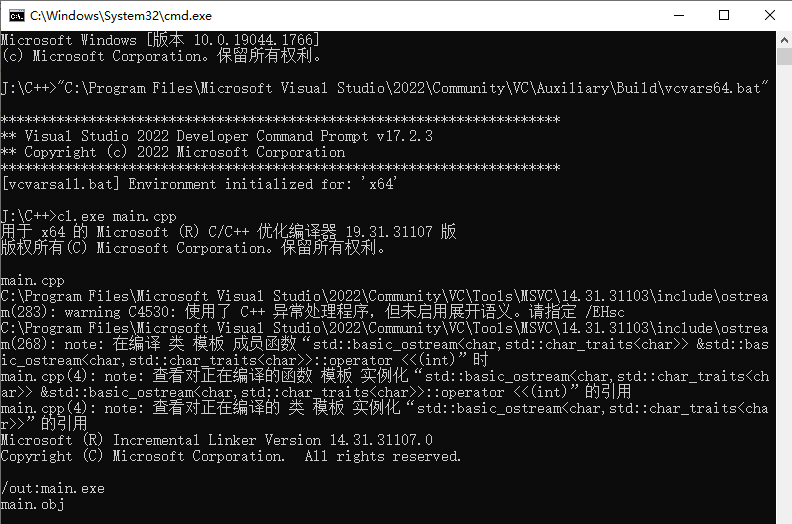
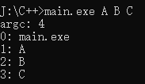
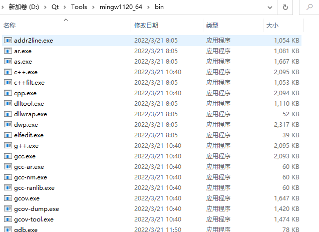

# C++学习路线

## 学习途径

对于C++初学者而言，最好的学习方式无疑是混迹于各大刷题平台：

-  LeetCode：https://leetcode-cn.com/
-  牛客网：https://www.nowcoder.com
-  Virtual Judge：https://link.zhihu.com/?target=https%3A//vjudge.net/
-  杭电HDUOJ：https://link.zhihu.com/?target=http%3A//acm.hdu.edu.cn/
-  PTA | 程序设计类实验辅助教学平台 ：(https://pintia.cn/problem-sets/dashboard)
-  ...

通过编程训练，可以快速地掌握C++的基本语法和各类数据结构与算法，塑造自己的编程思维，并且刷题并没有阅读资料那么枯燥。

笔者强烈 **建议初学者在此阶段花一到两年打磨** 。

对于一些工具书籍，如：《C++ Primer Plus》、《C++ Templates》...，可以粗读，至少知道C++有什么，遇到相应问题，再回来细读。

对于一些源码剖析及工程实践类书籍，如《STL源码剖析》，不建议深读，因为该类书籍是通过大量特定工程实践的经验堆叠而成，很多内容对于没有相关工程经验的小伙伴而言，收益并不高，人的生命和精力有限，现代社会为什么高度发达，正是因为我们站着巨人的肩膀上。

在学习过程中，有一些论坛可供小伙伴一起讨论：

- Stack Over Flow：https://stackoverflow.com/
- CSDN：https://www.csdn.net/
- 掘金：https://juejin.cn/
- 知乎：https://www.zhihu.com/hot
- 牛客：https://www.nowcoder.com/discuss

这里有一个非常好的C++教程：

- https://www.bilibili.com/video/BV1Wd4y1t7fZ/

还有一份完整的C++资源合集：

- https://github.com/fffaraz/awesome-cpp

过了入门的阶段，小伙伴们就可以开始接触工程实践了，该阶段需要参考一些 **质量高** 的项目 **并不断尝试** 

> 这里笔者建议大家学习一下Qt，它的代码迭代了几十年，代码质量非常高，最重要的是 **文档齐全** ！千万不要把Qt当成一个简单的GUI框架，个人认为它可以算是当下学习收益最高的C++框架（后面的章节细说）
>
> Qt Creator中提供了很多官方示例，Github上也拥有大量的优质项目。
>
> 学习任意框架， **一定一定一定** 要先过一遍框架的官方文档，一般情况下它绝大多数是信息最全的地方。

在学习过程中，多思考它的工程架构，设计模式...

这里推荐几本书籍：

- 《C++代码整洁之道》
- 《重构：改善既有代码的设计》
- 《设计模式》
- 《Effective C++》《More Effective C++》

## 发展路线

对于一个本科生而言，笔者建议的发展路线是：

- 花一到两年，疯狂刷题，参加各类编程比赛，如ACM、蓝桥杯、PAT...
- 花一到两年，疯狂写工程，不断试错，多找参考，重构代码，打磨自己的架构能力

> 这里笔者给一个参考度量：四年，刷题量300+，总代码量20W+行

- 大三就可以开始投简历找实习，注意锻炼自己的沟通能力

> 当你发展到一定阶段的时候，你会发现，限制自己技术的不再是能力，而是时间和精力，可能在学习过程中，你是孤独的，但最终，你还是需要回归集体~
>
> 不过放心，他们能与你共情

- 大四好好准备自己的毕业设计和答辩，不论成绩，无愧自己

### 发展方向

- 音视频流媒体开发
- 客户端
- 游戏开发
- 服务器
- 图形、引擎
- 嵌入式
- 高性能
- 网络安全
- 人工智能
- ...

> 如果你需要了解上述方向的技术要求，那么打开招聘网站，例如：
>
> - 牛客：https://www.nowcoder.com/jobs/recommend/campus
> - Boss直聘：https://www.zhipin.com/
> - 前程无忧:https://jobs.51job.com/
> - 智联招聘:https://landing.zhaopin.com/
> - 猎聘：https://www.liepin.com/
> - 脉脉：https://maimai.cn/
>
> 亦或是公司的招聘网站，比如：
>
> - 网易：https://hr.game.163.com/index.html
> - 腾讯：https://careers.tencent.com/
>
> 对应的岗位职责就是你的学习目标


## 误区

国内C++的技术环境并不是很友好，尤其是在一些高校里面，可能许多人都会 **过度夸大C++的难度** ，一谈到C++，就会联想到：

- C++是用来做后端的
- C++都过时了吧，Python、Go、Rush...未来都会取代它
- ...

对此，笔者也只能说无知者无畏...

这也不能怪他们，因为国内互联网公司盛行，它们主要以业务逻辑为导向，更看重开发效率，维护成本

C++不是为业务而生的，它更专注于计算机技术，很多东西存在即合理，当然也确实是有一些历史包袱...

而那些后起之秀对一些应用场景做了极大的优化，使用它们开发体验确实有较大的提升。

引用之前章节的一句话： **”道生一，一生二，二生三，三生万物“** ，越接近道，需要掌握的东西越少，掌握之后能够衍生的"物"更多，但要从万千事物中去寻到所谓的 **道** ，会难上许多，你可能需要矫正你人性化的思维，让自己的思考方式更像一台计算机，一个机器，这样你才能发现 — C++是多么的优雅~

> 切记不要入了培训班的坑，暂不谈培训班课程的质量有多高，学习本来就是锻炼自己对信息的搜集和整理能力，老想着走捷径，就容易被人割韭菜，无欲则刚~


## 编译与构建

将 **集成开发环境** (IDE: Integrated Development Environment ) 当成编译器是很多初学小伙伴的弊病，一谈到编译器，可能第一反应会是 Visual Studio、Visual Studio Code、Clion、XCode、Dev、VC...

虽然现代开发过程中开发者很少去直接操作编译器，但你需要至少了解这个东西，避免自己的知识体系中存在雾区

> 在后续的反射章节中，会直接接触到编译器的实现

关于编译器，百度百科中有如下定义：

> **[c++编译器](https://baike.baidu.com/item/c%2B%2B%E7%BC%96%E8%AF%91%E5%99%A8/2311223)**
>
> [编译器](https://baike.baidu.com/item/编译器/8853067)就是将“[高级语言](https://baike.baidu.com/item/高级语言/299113)”翻译为“[机器语言](https://baike.baidu.com/item/机器语言/2019225)（低级语言）”的程序。
>
> 一个现代编译器的主要工作流程：[源代码](https://baike.baidu.com/item/源代码/3814213) (source code) → [预处理器](https://baike.baidu.com/item/预处理器/9067800) (preprocessor) → 编译器 (compiler) → [汇编程序](https://baike.baidu.com/item/汇编程序/298210) (assembler) → [目标代码](https://baike.baidu.com/item/目标代码/9407934) (object code) → [链接器](https://baike.baidu.com/item/链接器/10853221) (Linker) → [可执行程序](https://baike.baidu.com/item/可执行程序/5723075) (executables)。

> **维基百科**：https://en.wikipedia.org/wiki/C%2B%2B

常见的C++编译器有：GCC/G++、ICC、Clang、MSVC、BCC。

> 对于程序开发者而言，往往无需深入了解这些编译器细节，只需要知道它们存在、以及存在的意义即可。
>
> 关于它们的讨论，可查阅知乎[各个C/C++编译器有什么特长和不足？](https://www.zhihu.com/question/23789676)

如果你还没用过C++的编译器？那就跟UP一起来用一遍吧~

### 编译流程

如果你有 **Visual Stuidio** ，可以在如下目录找到 **cl.exe** 


在 **地址栏** 输入`cmd`，按下`回车键`，可以在当前目录创建一个控制台窗口：


在控制台中输入`cl.exe /help`，按下`回车键`，你能看到它的帮助文档：

> 输入过程中按`Tab键`可自动补全


看着这些参数，是否有点眼熟？哟，这不是VS的项目配置吗？


cl.exe是一个命令行程序，下面我们将用这个命令行程序去生成我们自己的命令行程序。

首先，在任意路径下，新建一个新文件，名为 **main.cpp** ，其代码如下：

``` c++
#include <iostream>

/**
* argc 为参数的个数
* argv 为参数字符串数组
*/

int main(int argc,char** argv) {
	std::cout << "argc: " << argc << std::endl;
	for (int i = 0; i < argc; i++) {
		std::cout << i <<": " << argv[i] << std::endl;
	}
	return 0;
}
```

在windows文件浏览器的地址栏中输入`cmd`+`回车`，打开控制台创建，先输入指令`cl.exe+回车`，进行测试：


> 如果出现错误： **cl.exe 不是内部或外部命令，也不是可执行的程序** 
>
> 是因为控制台程序在当前的工作目录下没有找到该文件，为了解决这个问题，操作系统往往会提供 **环境变量** 的设置，它允许一些特定目录下的文件可以被全局访问，关于环境变量，请查阅 [此处](https://baike.baidu.com/item/%E7%8E%AF%E5%A2%83%E5%8F%98%E9%87%8F/1730949?fr=aladdin)

接下来我们还需要初始化控制台的运行环境，以便cl.exe能正确地搜索到C++的标准库路径，在VS的如下目录可以找到文件 **vcvars64.bat** ：


将之拖拽到我们刚刚的控制台窗口中，按下`回车`，就能成功初始化环境：


接下来再输入指令`cl.exe main.cpp`，编译该文件：



编译成功将生成两个文件：

- **main.obj**：目标文件，编译时的中间文件

- **main.exe**：windows下的可执行文件


> 这里实际上cl.exe进行了多个步骤：
>
> - 预编译：将源文件（`*.c`，`*.cpp`）输出为`*.i`文件：编译源代码中的预处理指令，比如#define，#include，#if...
> - 编译：将`*.i`编译为`*.s`文件：将高级语言转换为汇编语言。
> - 汇编：将`*.s`编译为`*.o`文件：将汇编语言转换成机器指令。
> - 链接：链接`*.o`文件，最终合并为可执行文件（windows下为`*.exe`）

再在控制台中输入指令`main.exe A B C`，将看到如下打印：



其中参数0为程序的启动路径，后面的A、B、C则是我们的附加参数。

在之后的开发过程中，你可能会碰到大量类似这样的命令行程序：

- 它们没有图形界面，只通过解析参数来完成各类工作，对于一些复杂的参数，有很多开源的 **CommandLine解析库**  ，比如Qt的QCommandLineParser，Github上也有许多可供使用。
- 对于图形界面程序，也可以利用该参数实现一些其他功能，比如，通过在注册表中追加启动参数来让程序在执行时判断是否是开机自启。

> 在Visual Studio中，也可手动设置该参数，用于开发时的调试：
>
> 

如果你有Qt的话，同样能在如下目录找到 **MinGW** 的编译套件：（关于它的使用，跟上面的步骤大同小异）



### 构建工具

上面我们用Visual Studio的CL编译器简单过了一遍C++的编译流程。

这里引入一个新的问题：在实际的工程开发当中，不可能只有一个源文件，这也意味着我们需要编写大量的构建指令。

可以通过 **make工具** 调用编写好的 **makefile文件** 来组织项目的构建，但由于makefile的指令无法跨平台，因此也涌现出了大量的跨平台工程构建工具，比如：

- [cmake](https://cmake.org/)：当下主流的跨平台构建工具
- [qmake](https://doc.qt.io/qt-6/qmake-manual.html)：由Qt提供的一个构建工具，目前Qt已全面转向Cmake，qmake已不再维护。
- [nmake](https://docs.microsoft.com/en-us/cpp/build/reference/nmake-reference)：Visual Studio的内置工具，负责执行Makefile中描述的编译链接步骤
- [xmake](https://xmake.io/)：国人编写的基于 Lua 的轻量级跨平台构建工具。
- [UBT](https://docs.unrealengine.com/5.0/en-US/unreal-build-tool-in-unreal-engine/)：Unreal Engine 中基于C#的构建工具

对于大部分C++初学者来说，项目的构建可能大多时候都是直接使用IDE的图形化界面，比如Visual Studio：


这样做确实可以满足我们初期的一些小的开发需求，比如编程训练，小项目之类，但在开发一些庞大的工程项目时，使用图形界面的方式管理会异常困难，这点在后面的章节细谈。
