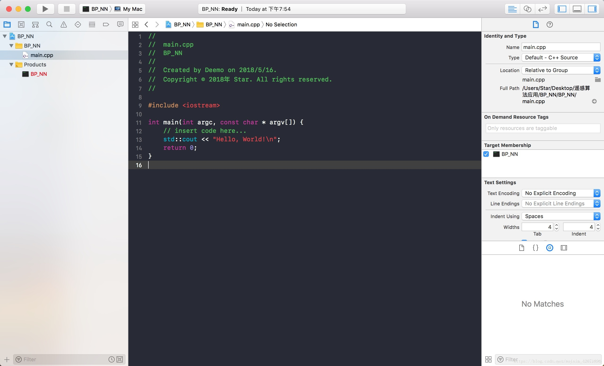
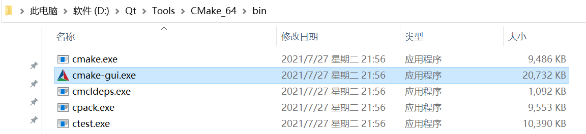

# 现代开发工作流

俗话说工欲善其事，必先利其器

好的工具链可以大幅度提升开发效率，正所谓人生苦短，咱一定得善待自己...

## IDE

**IDE（Integrated Development Environment 集成开发环境）**是现代程序员接触最频繁的工具，它不仅提供了编译工具，往往还包含：

- 编辑器：用来编写代码，并且给代码着色，以方便阅读
- 代码提示器：输入部分代码，即可提示全部代码，加速代码的编写过程
- 调试器：观察程序的每一个运行步骤，发现程序的逻辑错误
- 项目管理工具：对程序涉及到的所有资源进行管理，包括源文件、图片、视频、第三方库等
- 漂亮的界面：各种按钮、面板、菜单、窗口等控件整齐排布，操作更方便
- 性能探查器

当下主流的C++ IDE有：

- [Visual Studio](https://visualstudio.microsoft.com/zh-hans/)：由微软提供，被很多人尊称为“宇宙第一IDE”，体积庞大，Windows系统下的开发首选。

  

- [Qt Creator](https://www.qt.io/product/development-tools)：由Qt官方提供的IDE，跨平台，功能上中规中矩，对于Qt程序的开发来说比较友好。

  

- [Clion](https://www.jetbrains.com/zh-cn/clion/)：**JET BRAINS**提供的IDE，代码的辅助功能很巴适，旗下另一IDE — **Rider**：专门为游戏引擎开发而立。

  

- [XCode](https://developer.apple.com/xcode/)：Mac系统下的IDE

  

- [Visual Studio Code](https://code.visualstudio.com/)：微软提供的跨平台代码编辑器，通过扩展插件可以使得它一样能进行程序编译。

  

对于笔者而言，早期刷题也是被学校强制使用DevC++，VC6.0，当时还用的乐此不疲，现在回头一看确实感觉有些不堪~


笔者的IDE之前经历了以下几个阶段：

VC6.0 > Dev c++ > Visual Studio > IDEA(Java) > Qt Creator

目前，笔者在 Windows 下用 **Visual Studio** 编写 C++代码， **Visual Studio Code** 处理一些常见的文本文件，如Lua，Python、GLSL...

**Visual Studio Code** 毫无疑问的最好的文本编辑器（拥有非常非常多的插件），而C++的IDE其实都大差不大，该有的功能基本都有，笔者使用Visual Studio做C++开发，主要是因为UI好看以及汉化完整...

### Visual Studio

请务必查阅官方文档：https://docs.microsoft.com/en-us/visualstudio/windows


#### 常用插件

- [VAssistX](https://www.wholetomato.com/)：提供了大量的辅助功能，提升编码效率，请务必查阅：https://www.wholetomato.com/features

- [CodeMaid](https://www.codemaid.net/)：用于代码的整理与简化，提供一些编辑功能

- [Qt VS Tools](https://doc.qt.io/qtvstools/index.html)：Qt的Vs插件，可在配置中开启按F1打开对应代码的Qt文档

#### 常用快捷键

- 代码编辑

  - 剪切/复制/粘贴：`Ctrl+X` / `Ctrl+C` / `Ctrl+V`
  - 代码注释/取消：`Ctrl+K` + `Ctrl+C`  / `Ctrl+K` + `Ctrl+U`
    - 创建新行
  
      - 下方：`Ctrl+Shift+Enter`
      - 上方：`Ctrl+Enter`
  - 复制本行并粘贴在下方：`Ctrl+D`
  - 撤销/重做：`Ctrl+Z` / `Ctrl +Y`
    - 大小写转换：
      - 转小写：`Ctrl+ U`
      - 转大写：`Ctrl+Shift+U`
  - 触发智能提示：`Ctrl+J` 或 `Alt+ →`
  - 触发自动填充：`Alt+Enter`
- 浏览与检索

  - 头文件和源文件之间跳转：`Alt+O`
  - 当前文件搜索/替换：`Ctrl+F` / `Ctrl+H`
  - 全局文件搜索/替换：`Ctrl+Shift+F` / `Ctrl+Shift+H`
  - 根据文件名搜索并跳转：`Ctrl+1` + `Ctrl+F` （先按Ctrl+数字1，再按Ctrl+F）
  - 根据行数跳转：`Ctrl+G`
  - 浏览位置 回退/前进：`Alt+←` / `Alt+→`
  - 在活动文件中切换：`Ctrl+Tab`
  - 折叠当前代码块/取消：`Ctrl+M` +`Ctrl+M` 
  - 全部代码折叠到定义/取消：`Ctrl+M` + `Ctrl+O` / `Ctrl+M` + `Ctrl+X`

  - 光标跳转
    - 行首/行尾：`Home` / `End`
    - 文件首/文件尾：`Ctrl+Home` / `Ctrl+End`

  - 翻页：`Page Up` / `Page Down` 

#### 达成目标

- 知道如何安装与更新插件及模块
- 熟练使用单步调试，内存及性能探查工具，了解[PDB](https://docs.microsoft.com/en-us/visualstudio/debugger/specify-symbol-dot-pdb-and-source-files-in-the-visual-studio-debugger?view=vs-2022)文件
- 熟练使用各类快捷键
- 了解项目配置中各个参数的意义
- 注意代码文件的编码格式

## 构建工具

上一节中，我们用Visual Studio的CL编译器简单过了一遍C++的编译流程，在实际的工程开发当中，一个工程绝大多数情况下都不会只有一个源文件，这意味着我们要写一大堆编译指令，不过好在我们可以把指令写在**makefile**文件里，如何通过 **make** 工具进行构建，但这还有一个非常严重的问题：

> 你一个Windows下的指令，放到 Linux下面，它不认呐~

是的，由于makefile是直接调用操作系统的指令，但各个系统之间的指令却存在差异，这也涌现出了大量的跨平台工程构建工具，比如：

- [cmake](https://link.zhihu.com/?target=https%3A//cmake.org/)：当下主流的跨平台构建工具
- [qmake](https://link.zhihu.com/?target=https%3A//doc.qt.io/qt-6/qmake-manual.html)：由Qt提供的一个构建工具，目前Qt已全面转向Cmake，qmake已不再维护。
- [nmake](https://link.zhihu.com/?target=https%3A//docs.microsoft.com/en-us/cpp/build/reference/nmake-reference)：Visual Studio的内置工具，负责执行Makefile中描述的编译链接步骤
- [xmake](https://link.zhihu.com/?target=https%3A//xmake.io/)：国人编写的基于 Lua 的轻量级跨平台构建工具。
- UBT：Unreal Engine 中基于C#的构建工具

对于大部分C++初学者来说，项目的构建可能大多时候都是直接使用IDE的图形化界面，点击操作按钮来添加源文件，比如Visual Studio：


图形界面在使用起来确实方便，但也存在一些不足：

- 如果连IDE都不支持跨平台，它的工程文件肯定也无法跨平台，这样的话其他平台就编译不了
- 在不同的系统上，会有不同的构建配置，通过图形界面只能进行静态的配置，而不能实现自动化的构建逻辑
- 通过图形界面配置的工程文件，当文件路径或者系统发生变动，可能导致原先的链接丢失
- 库的管理容易混乱，且过于繁琐...

> 话虽如此，笔者在早期没有使用构建，纯图形界面写工程也照样没什么问题（菜是原罪）
>
> 迫使我放弃使用图形界面的主要原因有：
>
> - 需要在程序编译之前，对工程中一些文件做“预处理”再交由C++编译器进行编译（抄袭Qt的Moc：[XObject](https://github.com/Italink/XObject)）
> - 在程序编译之前，执行一些脚本或指令，比如提前将着色器代码编译为二进制文件

那上面 **那么多构建工具该选什么呢？**

### CMake

为什么是CMake呢，它很强大吗？不，这不是主要原因，最根本的原因是：**大部分开源群体都使用CMake作为构建工具**，使用它你能很方便的引入其他三方库。

笔者用下来感觉确实不错，使用它有以下几个好处：

- CMake可以生成各个平台IDE的工程文件
- 使用CMake可以编写逻辑代码，完成自动化构建，适配各个平台的构建细节
- 方便管理子工程（库）
- 工程文件具有依赖分析，编译速度极快

对于初学者而言，一般只需要熟悉CMakeGUI的使用和CmakeLists基本语法

#### CMake GUI

CMake GUI是一个**亲切的**图形化界面，可以代替命令行操作

大家安装完Cmake 之后，注意创建一下 CMake GUI的桌面快捷方式



想要构建CMake项目的时候直接打开CMake GUI：

- 将CMakeLists.txt拖到窗口里，设置一下`Where to build the Binaries`，构建目录，笔者一般会在源目录后面追加`/build`

- 点击`Configure`会出现一个弹窗，选择想要生成的 IDE 工程文件，以及一些命令行参数

  

- `Finish`之后，这个会出现一些可供调整的配置选项，可根据描述进行调整

- 再点击`Generate`，将会生成对应IDE的工程文件

- 最后点击`Open Project`，就会直接用对应IDE打开工程了

如果后续代码文件结构发生变动，就需要重新在Cmake GUI 中 `Generate` 一下，不过一般IDE在检测到**CMakeLists内容有变动**的时候会自动触发 `Generate`

>一些IDE可能支持直接打开CMakeList.txt，比如Qt Creator和Visual Studio，对于Visual Studio，笔者更建议使用CMake GUI 的方式，生成 VS 的工程文件（`*.sln`）


#### CMakeList基本语法

CMake并不难，不过是原来 【手动添加点击按钮一个源文件的操作 】换成了：

``` cmake
add_executable(${TargetName} *.h *.cpp ...)				//创建可执行文件
// add_library(${TargetName} STATIC *.h *.cpp ...)		//创建静态库
// add_library(${TargetName} SHARED *.h *.cpp ...)		//创建动态库
```

如果想引入其他库就用：

``` cmake
target_link_libraries(${TargetName} PRIVATE ${LibraryName})  
//PRIVATE代表只有${TargetName}可以访问${LibraryName}中的代码
//PUBLIC代表引入${TargetName}的其他库，也可以访问${LibraryName}中的代码
```

如果想增加Include路径就用：

``` cmake
target_include_directories(QEngineEditor PRIVATE ${IncludeDir}) 
```

如果想操作一个局部变量就直接用：

```cmake
set(VarName "This is String")
messgae(Warning ${VarName})  // 使用${}包裹来读取变量，这里的操作是打印VarName的值
```

想添加子目录就用（子目录指拥有CMakeLists.txt 的路径）

``` cmake
add_subdirectory(${Subdir})
```

基础操作无非就这么一些，其他什么跨平台配置呀，自动化构建呀，框架配置什么的，只要你觉得某个配置或者功能是合理的，那么它大概率就存在，网上一搜，官网一查，就出来了，构建文件的改动并不频繁，只需要知道主体逻辑即可

构建工具其实都大差不大，用啥都无所谓，它们的使用都不难，关键难的是各种平台和框架的细节配置，这个无可避免。

关于CMake的使用，网上有很多优质的教程，不过笔者更推荐去阅读它的官方文档：https://cmake.org/cmake/help/latest/guide/tutorial/index.html


## 版本管理

Git

SVN

Github、Gitee、Gitlab

## 项目管理

Trello


## 文档笔记

### Markdown

https://support.typoraio.cn/zh/Markdown-Reference/

#### Typora

#### 


## 其他

### Excel

### PPT

### PS

